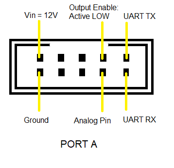

# Introduction
This library is for the Cytron Line Sensing Array: LSA08 (reference  [here](https://www.cytron.io/p-lsa08)).

# Index
- [Introduction](#introduction)
- [Index](#index)
- [User Guide](#user-guide)
    - [Downloading the library](#downloading-the-library)
    - [Using the library with Arduino](#using-the-library-with-arduino)
- [Library Explanation](#library-explanation)
  - [Examples](#examples)
   - [SerialRead](#serialread)
   - [SerialRead_Buffer](#serialread_buffer)
   - [AnalogRead](#analogread)
- [Developers Guide](#developers-guide)
    - [Library Details](#library-details)
    - [Class contents](#class-contents)
        - [Private members](#private-members)
            - [Variables](#variables)
            - [Member functions](#member-functions)
        - [Public members](#public-members)
            - [Constructors](#constructors)
            - [Member functions](#member-functions)
- [References](#references)

# User guide
## Downloading the library
It is suggested that you download the entire repository and then select this folder, so that you can enjoy the benifits of VCS like git. It makes it simpler to update the contents whenever patch fixes are done. You can simply open a terminal (or gitbash on windows), go to the folder where you want to save this repository and type the following command.
```
git clone https://github.com/RoboManipal-9-0/Libraries.git
```
**Not recommended**: You can download _only_ this folder by clicking [here](https://minhaskamal.github.io/DownGit/#/home?url=https://github.com/RoboManipal-9-0/Libraries/LSA08)

## Using the library with Arduino
Move this folder into the arduino libraries folder on your PC. If you don't know where the libraries folder of your arduino is, you can click [here](https://www.arduino.cc/en/hacking/libraries).<br>
Also, this Library makes use of the [DebuggerSerial Library](../DebuggerSerial). For More Information on this, click [here](https://github.com/RoboManipal-9-0/Libraries/tree/master/DebuggerSerial).

In order to use this library, you must do the following:
- Include the header file `LSA08.h` (the *LSA08* library folder must be in your arduino libraries folder).
- Create an object of class `LSA08`. You can pass the constructor parameters to initialize here itself, or leave it as a simple object declaration.
- Initialize the Serial on which the LSA is attached using the `AttachSerial` function. You may optionally initialize and attach a debugger serial as well (using `debugger.Initialize` function on the object). You can access the debugger using the `debugger` variable of the class.

# Library Explanation
The Library uses the LSA Module with the following Pin Out -



# About LSA08

### Setting Menu of LSA08:

| Menu | Description |
|:----:| :----: |
| LCD Contrast (LCD CON) | Setting the contrast of LCD. |
| Calibration (CALB) | Calibrate LSA08 to the colour brightness of the line and background. |
| Line Mode (LINEMODE) | Setting LSA08 to be Dark On (for dark line and bright background) or Light On (for bright line and dark background). |
| Threshold (THRES) | Set according to the surface condition of the line. It is the number of Lines in a bar as shown on the LCD. The threshold value can be set from 0 to 7. |
| Junction Width (J WIDTH) | The number of bar chart on LCD for a junction crossing. |
| UART addressing (UART ADD) | Application Not Applicable here. |
| UART Baudrate (BAUDRATE) | Setting the baudrate of the UART Communication. |
| UART Mode (UARTMODE) | To be Set as 2 |
| LCD Backlight (LCD B/L) | Setting the LCD backlight brightness |
| Exit (EXIT) | Exit Menu |

Note: Press and hold Mode button on any main menu will exit the menu.

### Baudrates for the LSA08:

| Baudrate No. | Baudrate |
|:----:| :----: |
| 0 | 9600 |
| 1 | 19200 |
| 2 | 38400 |
| 3 | 57600 |
| 4 | 115200 |
| 5 | 230400 |

## Examples

### SerialRead
This example show you to Read values from the LSA using the `LSA08` library on Serial2 without the use of any Buffer.<br>
File: [./examples/SerialRead/SerialRead.ino](./examples/SerialRead/SerialRead.ino)<br>

We simply follow the following steps:
1. Include library
2. Create object
3. Initialize Serials. LSA08 on **Serial2** and debugger on **Serial**. Keep in mind to match the baud rates.
4. Initialize debugger. Name it `LSA`.
5. Then start a loop
    1. Read LSA Values using ReadLSA Function.
    2. The Values will be printed by the Debugger Object.
6. Re-run the loop

### SerialRead_Buffer
This example show you to Read values from the LSA using the `LSA08` library on Serial2 using a Buffer or by using the Enable Pin (if not Grounded Electronically).<br>
File: [./examples/SerialRead_Buffer/SerialRead_Buffer.ino](./examples/SerialRead_Buffer/SerialRead_Buffer.ino)<br>

We simply follow the following steps:
1. Include library
2. Create object
3. Initialize Serials. LSA08 on **Serial2** and debugger on **Serial**. Keep in mind to match the baud rates. Also, set the Pin Value for the Buffer Control Pin (or Enable Pin) and Active State of the Buffer Control (LOW incase of the Default Enable Pin).
4. Initialize debugger. Name it `LSA`.
5. Then start a loop
    1. Read LSA Values using ReadLSA Function.
    2. The Values will be printed by the Debugger Object.
6. Re-run the loop

### AnalogRead
This example show you to Read values from the LSA using the `LSA08` library using the Analog Pin.<br>
File: [./examples/AnalogRead/AnalogRead.ino](./examples/AnalogRead/AnalogRead.ino)<br>

We simply follow the following steps:
1. Include library
2. Create object
3. Initialize Serials. LSA08 on **Pin No: 8** and debugger on **Serial**.
4. Initialize debugger. Name it `LSA`.
5. Then start a loop
    1. Read LSA Values using ReadLSA Function.
    2. The Values will be printed by the Debugger Object.
6. Re-run the loop

# Developers guide

## Library Details
### Files in the Library
The files in the library are :

#### LSA08.h
This is the Header file and contains the Class Blueprint (Prototype).

#### LSA08.cpp
This file contains the Definiton for the Class Member Functions Prototyped in the Header File.

#### README.md
The Description file containing details about the library. The file that you looking at right now.

# Class Contents
Let's explore the contents of the class, but first, we also have literals defined for general purpose use (using `#define`). They are:

| Name | Value | Purpose |
|:----:| :----: | :----- |
| MODE_SERIAL| 0 | Value passed to select the Serial Mode for receiving Values. |
| MODE_ANALOG | 1 | Value passed to select the Analog Mode for receiving Values. |

| Name | Value | Purpose |
|:----:| :----: | :----- |
| BUFFER_OFF | 0 | Indicates that the Serial is not connected to any Buffer. |
| BUFFER_ON | 1 | Indicates that the Serial is connected to a Buffer. |

Let's explore the class now

### Private members

##### Variables
- **<font color="#CD00FF">HardwareSerial</font> \*LSASerial**: This is the serial on which the LSA operates.
- **<font color="#CD00FF">int</font> currentValue**: The LSA Value at Present.
- **<font color="#CD00FF">int</font> previousValue**: The Last Non - 255 Value of the LSA.
- **<font color="#CD00FF">int</font> analogPin**: Pin Number to which the Analog Pin of the LSA is connected.
- **<font color="#CD00FF">int</font> flagValue**: Reference Value of the LSA indicating the following -

| Flag Value | LSA Value ( Range ) |
| :--------- | :----------------: |
| 0 | 0 |
| 1 | 1 - 34 |
| 2 | 35 |
| 3 | 36 - 69 |
| 4 | 70 |
| 5 | 255 |

- **<font color="#CD00FF">bool</font> bufferStatus**: Indicator whether the LSA is connected to a buffer  or not.
- **<font color="#CD00FF">int</font> bufferPin**: Pin Number of the Buffer Control Pin.
- **<font color="#CD00FF">bool</font> bufferPinStatus**: Active Status for the Buffer Control Pin.

#### Member functions
- **<font color="#CD00FF">void</font><font color="#5052FF">ClearLSA</font> ( )** : Clear the Junk Values from the LSA.
- **<font color="#CD00FF">void</font><font color="#5052FF">SetFlag</font> ( )** : Set the Flag Value for the LSA.

### Public members
#### Members
- **<font color="#CD00FF">DebuggerSerial</font> debugger**: The debugger for the class. Check the [DebuggerSerial documentation](https://github.com/RoboManipal-9-0/Libraries/tree/master/DebuggerSerial) for more on this.

#### Constructors
- **<font color="#5052FF">LSA08</font> ( )** : Empty constructor for the class.
- **<font color="#5052FF">LSA08</font> ( <font color="#FF00FF">HardwareSerial</font> \*LSASerial )** : To attach a pre-initialized serial to the LSA. This function calls the _AttachSerial_ member function along with the previously mentioned Constructor using Constructor Delegation.
- **<font color="#5052FF">LSA08</font> ( <font color="#FF00FF">HardwareSerial</font> \*LSASerial , <font color="#FF00FF">int</font> bufferPin , <font color="#FF00FF">bool</font> bufferPinStatus )** : To attach a pre-initialized serial to the LSA on a Buffer. This function calls the _SetBuffer_ member function along with the previously mentioned Constructor using Constructor Delegation.
- **<font color="#5052FF">LSA08</font> ( <font color="#FF00FF">int</font> analogPin )** : To Set the Pin Number to which the Analog Pin of the LSA is connected. This function calls the _AttachAnalogPin_ member function.

#### Member functions
- **<font color="#CD00FF">bool</font> operator == ( <font color="#FF00FF">int</font> flagValue )** : Checks for Equality of a Flag Value directly with the LSA Variable.
- **<font color="#CD00FF">bool</font> operator != ( <font color="#FF00FF">int</font> flagValue )** : Checks for Inequality of a Flag Value directly with the LSA Variable.
- operator **<font color="#CD00FF">int</font> ( )** : Implicit Type Conversion from Object Type: LSA08 to int Type for Easy Assignment and Comparision.

- **<font color="#CD00FF">void</font> SetBuffer ( <font color="#FF00FF">int</font> bufferPin , <font color="#FF00FF">int</font> bufferPinStatus )** : Sets the Buffer Control Pin and Value for the LSA.
- **<font color="#CD00FF">void</font> AttachSerial ( <font color="#FF00FF">HardwareSerial</font> \*LSASerial )** : Attach the Serial to the LSA.
- **<font color="#CD00FF">void</font> AttachSerial ( <font color="#FF00FF">HardwareSerial</font> \*LSASerial , <font color="#FF00FF">int</font> bufferPin , <font color="#FF00FF">bool</font> bufferPinStatus )** : Attach the Serial to the LSA. and Sets the Buffer Control Pin and Value.
- **<font color="#CD00FF">void</font> AttachAnalogPin ( <font color="#FF00FF">int</font> analogPin )** : Set the Analog Pin for Receiving Value in Analog Mode.
- **<font color="#CD00FF">int</font> ReadLSA ( )** : To Receive and Return the Current LSA Value.
- **<font color="#CD00FF">int</font> GetPreviousValue ( )** : To Return the Last Non - 255 Value of the LSA.

# References
- [LSA08 User Manual](./.DATA/LSA08_User_Manual.pdf).

[](https://github.com/shashank3199)